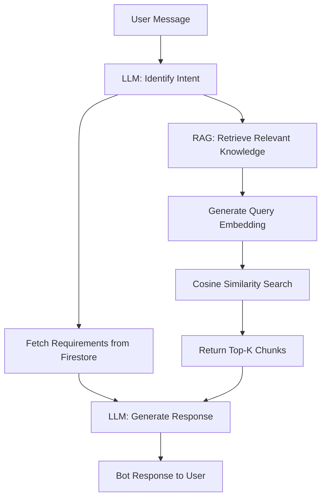

# FastLane 🚀

FastLane is a Flutter application designed to streamline the process of dealing with Philippine government services. By combining geolocation, an AI-powered conversational assistant, and an intuitive checklist tracker, FastLane serves as a digital liaison to help citizens seamlessly understand, prepare, and apply for essential government documents.

---

## 🌟 Key Features

1. **AI Chatbot Assistant (BINO)**
   - Powered by **Google Gemini 2.5 Flash** and **Gemini Embeddings**.
   - Implements a full **Retrieval-Augmented Generation (RAG)** pipeline.
   - Assists users with detailed, highly context-aware information regarding their required government documents (e.g., Passports, National IDs, NBI Clearances). Uses semantic searches against a pre-seeded Firestore knowledge base to return accurate advice.

2. **Smart Checklist Manager**
   - Automatically tracks the documents and requirements users need based on conversations with the AI Assistant.
   - Saves requirements in manageable, actionable checklist items linked to user accounts.

3. **Secure Authentication**
   - Integrates **Firebase Auth** for seamless account creation, logging in, and tracking personalized states.
   - Stores user profiles dynamically in **Firestore**.

4. **Geolocation & Interactive Maps**
   - Built heavily relying on mapping tools (`flutter_map`, `geolocator`, `latlong2`).
   - Retrieves real-time addresses via reverse geocoding to dynamically guide the user toward the nearest government facilities.

# Chatbot & RAG Module

## Overview

The Chatbot module provides a context-aware conversational agent designed to assist users with Philippine government document processes. Rather than just returning basic document intents and requirements, the chatbot employs **Retrieval-Augmented Generation (RAG)** to provide detailed, accurate, and context-rich answers about fees, application steps, eligibility criteria, and more.

It relies on **Firebase Firestore** for its knowledge base, the **Google Generative AI (Gemini 2.5 Flash)** model for reasoning/generation, and the **Gemini Embedding Model (gemini-embedding-001)** for semantic retrieval.

---

## Core Components

### `ChatbotController` (Presentation)
The central orchestrator in the presentation layer (`lib/chatbot/presentation/controllers/`).
- **State Management**: Maintains the chat history (`messages`) and loading states.
- **Lazy Initialization**: It initializes the RAG vector store (`_ensureRAGInitialized`) only when the user sends their first message to optimize app startup overhead.
- **Flow Coordination**: Manages intent detection, semantic search, and the final response generation, coordinating calls between the LLM and RAG services.

### `LlmService` (Data/Generation)
A wrapper around the `google_generative_ai` SDK (`lib/chatbot/data/llm_service.dart`).
- **`identifyUserIntent`**: Analyzes user input to map it strictly to an available government document type using strict JSON-constrained prompting.
- **`generateRAGResponse`**: Generates a conversational response by blending the user's core intent with retrieved text contexts (Knowledge Chunks).

### `EmbeddingService` (Data/AI)
Service responsible for converting text into vectors (`lib/chatbot/data/embedding_service.dart`).
- Uses `gemini-embedding-001` to capture the semantic mathematical representation of both stored knowledge chunks and user queries.

### `VectorStore` (Data/Retrieval)
A lightweight client-side, in-memory semantic database (`lib/chatbot/data/vector_store.dart`).
- Fetches all knowledge chunks upon initialization, passing them to the `EmbeddingService` for vectorization.
- **`search(query)`**: Converts incoming queries into vectors and calculates the **Cosine Similarity** against stored vectors to identify the Top-K most relevant chunks.

### `KnowledgeBaseService` (Data/Storage)
Provides access to Firestore (`lib/chatbot/data/knowledge_base_service.dart`).
- Interfaces directly with the `.collection('knowledge_base')` to fetch the raw documents containing text blobs to be utilized by the RAG pipeline.

### `KnowledgeBaseSeeder` (Data/Setup)
A utility script (`lib/chatbot/data/seed_knowledge_base.dart`).
- Pre-populated with hundreds of predefined facts regarding passports, national IDs, NBI clearances, etc.
- Seeds the `knowledge_base` database seamlessly if it detects that the Firestore collection is empty.

---

## The RAG Pipeline Workflow

When a user submits a query, the application executes the following sequence:

1. **Lazy Initialization**: If this is the user's first prompt, `VectorStore` fetches chunks from Firestore and generates text embeddings. (Any missing chunks are auto-seeded by the `ChatbotController`).
2. **Intent Classification**: `LlmService` takes the user's string and extracts a categorical intent, verifying if it aligns with standard document types.
3. **Semantic Retrieval**: 
   - `VectorStore.search()` is executed using the raw query. 
   - The user query is converted into a vector.
   - Using cosine similarity, the system finds the closest matching vectors. This search might be constrained strictly to the `documentType` determined in Step 2 for high topical accuracy.
4. **Augmented Prompt Synthesis**: `LlmService.generateRAGResponse` receives a constructed prompt comprising:
   - The user's query
   - Extracted document requirements.
   - *The top 3 retrieved semantic contexts (ragContext)*.
5. **Generation & Response**: Gemini responds with a highly-contextualized and friendly summary, fully addressing user questions about specific steps, edge-cases, and fees.

### Architecture Flowchart



---

## 🛠 Tech Stack

- **Framework:** Flutter (Dart 3)
- **State Management:** Provider Architecture (`ChangeNotifierProvider`, `ProxyProvider`)
- **Backend as a Service (BaaS):** Firebase
  - *Firebase Authentication* (Sign In / Sign Up)
  - *Cloud Firestore* (NoSQL Database for User Data, Checklists, & the RAG Knowledge Base)
- **Artificial Intelligence:** 
  - `google_generative_ai` SDK
  - Gemini 2.5 Flash & Gemini Embedding-001 Models
- **Mapping Services:** `flutter_map`
- **Environment Management:** `flutter_dotenv`

---

## 📁 Project Structure

```text
lib/
├── app/          # App initialization, routing, and overarching themes
├── auth/         # Authentication flow, login/register UI, and controllers
├── chatbot/      # The AI Assistant UI & the entire RAG pipeline (Services, Models)
├── checklist/    # State and UI for task requirement checklists
├── core/         # Cross-cutting concerns (Constants, Nav Controller, Firebase Options)
├── home/         # Primary navigation shell and dashboard rendering
├── map/          # Location services and interactive map components
└── main.dart     # Application entry point and Provider bindings
```

---

## ⚙️ Getting Started

### Prerequisites
1. Install [Flutter SDK](https://flutter.dev/docs/get-started/install).
2. Set up [Firebase](https://firebase.google.com/docs/flutter/setup) for your project.
3. Obtain a **Google Gemini API Key** from the [Google AI Studio](https://aistudio.google.com/).

### Installation & Setup

1. **Clone the repository:**
   ```bash
   git clone <repository_url>
   cd fast_lane
   ```

2. **Install Dependencies:**
   ```bash
   flutter pub get
   ```

3. **Environment Setup:**
   Create a `.env` file in the root directory:
   ```env
   GEMINI_API_KEY=your_gemini_api_key_here
   ```
   *(Ensure `.env` is listed under the `assets:` section of your `pubspec.yaml`)*

4. **Configure Firebase:**
   Ensure you run the FlutterFire CLI command at the root of the project to generate the `firebase_options.dart` file.
   ```bash
   flutterfire configure
   ```

5. **Run the Application:**
   ```bash
   flutter run
   ```

---

### 🧠 First-Time Execution (Knowledge Base)
By default, the `ChatbotController` enforces lazy initialization. On the very first startup and user message, `KnowledgeBaseSeeder` will automatically seed the Firestore `knowledge_base` collection with hundreds of government definitions and processing steps if it notices the database is empty. No manual database setup is necessary!

--- 

## Future Improvements

- **Local Persistence via Hive/SQLite**: Vectors are generated at runtime to avoid hitting embedding caps. Implementing local caching via Hive or SQLite could permanently store chunks and vectors locally after the initial fetch.
- **Vector Indexing (HNSW)**: For now, Cosine Similarity loops over all chunks in-memory. As the knowledge base grows to over ~1,000 documents, HNSW or a server-side vector DB (e.g., Pinecone/Milvus) may be necessary.
- **Conversational Memory**: Allow semantic retrieval to span the history of the current user conversation, instead of exclusively fetching contexts based only on the immediate message query.
